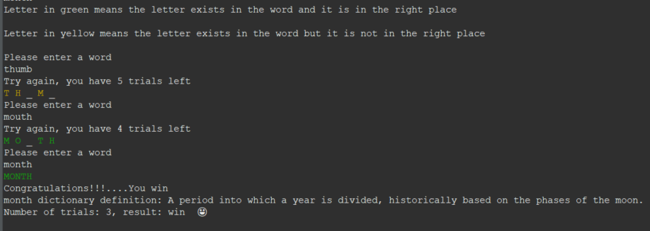

# Project: Wordle

## Image of the application

## Description

-   Recreate a simplified version of the game Wordle to be played in a Java console application
-   The game randomly selects a 5-letter word from the provided word list file (word-list.json).
-   The user will be able to enter a guess word that is also 5 characters long
-   For each letter, the application will tell the user if that letter is correct (it will be in green), right letter in the wrong position (it will be in yellow), or wrong letter (it will be replaced by "_").
-   After the user guesses 6 times incorrectly, the game is over and the user loses
-   If the user guesses the word correctly, the following will happen:
    - the game is over and the user wins
    - A history file that keeps track of user wins/losses and how many letters they guessed it in is created.
    -  When the game finishes and the secret word is shown, the dictionary definition for that word is displayed.
    -  Generate an output of the word/guesses and copy it to the user's clipboard so they can share it on socials

## Resources
-  I used an API (https://dictionaryapi.dev/) to get the secret word definition.

## How to run:
- In "Wordle/src/wordle/utils.java" line 41, specify the path where the word-list.json file is located.
- In "Wordle/src/wordle/utils.java" line 131, specify the path where the history of the game (history.txt) will be located.